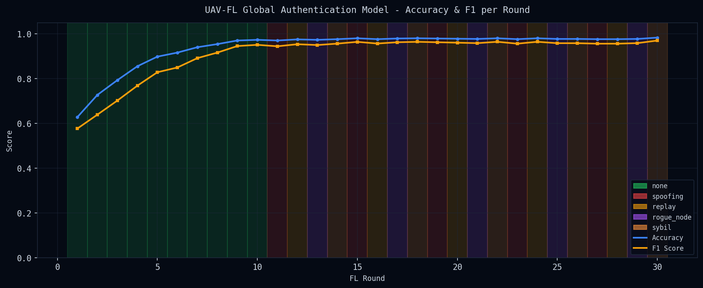
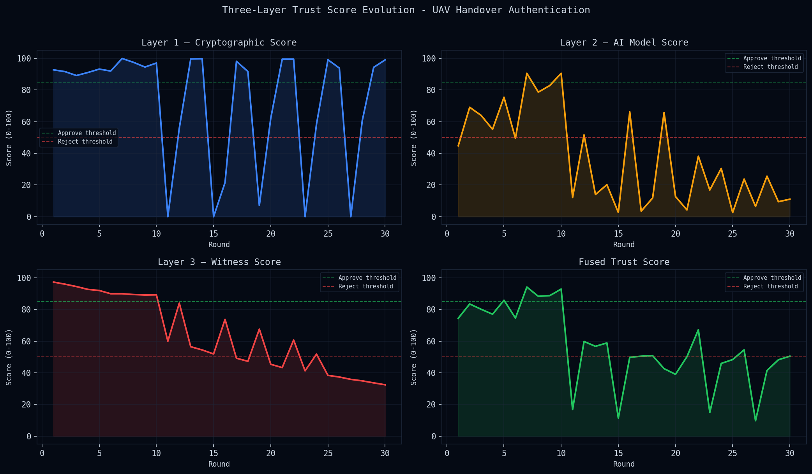
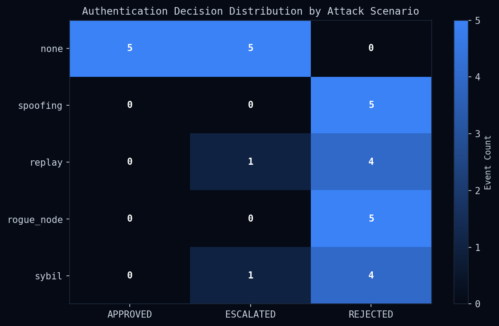
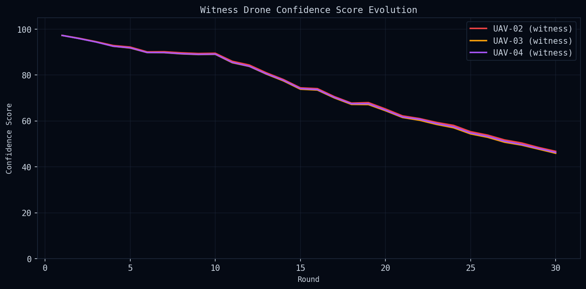
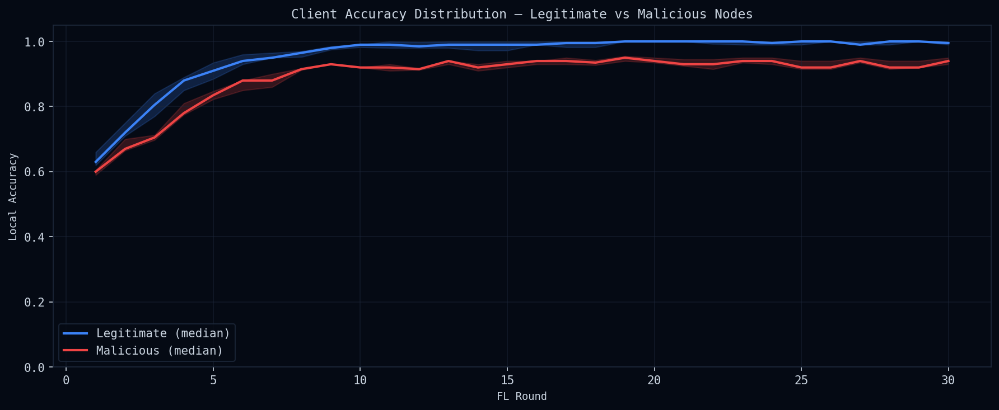

# Status Report — Implementation & Preliminary Experimentation
## UAV Federated Learning Handover Authentication Simulation

---

## 1. Implementation Status

| Component | Status | Notes |
|-----------|--------|-------|
| Python FL Engine (`fl_simulation/`) | ✅ Complete | 7 modules, fully functional |
| Dataset Generator | ✅ Complete | 12-feature synthetic UAV data, 500 samples/node |
| FL Server (FedAvg / Krum / Median / FedProx) | ✅ Complete | 4 aggregation algorithms |
| Witness Protocol | ✅ Complete | Quorum-based, Byzantine-aware |
| FastAPI WebSocket Backend | ✅ Complete | Real-time event streaming |
| React 3D Frontend | ✅ Complete | Three.js scene + live metrics UI |
| Results Visualization | ✅ Complete | 5 Matplotlib charts auto-generated |

---

## 2. Experimental Setup

| Parameter | Value |
|-----------|-------|
| Total UAV Nodes | 10 |
| Witness Nodes | 3 |
| FL Rounds | 30 |
| Local Epochs per Round | 3 |
| Local Batch Size | 32 |
| Learning Rate | 0.001 |
| Client Participation Fraction (C) | 0.8 |
| Byzantine Attack Fraction | 25% of relay nodes |
| Random Seed | 42 (deterministic) |

**Attack Schedule:** First 10 rounds clean → Rounds 11–30 rotate through: Spoofing, Replay, Rogue Node, Sybil

---

## 3. Preliminary Results

### 3.1 Global Model Convergence

The global authentication model converges rapidly under FedAvg:

- **Round 1** → Accuracy ≈ 0.72, F1 ≈ 0.70
- **Round 10** → Accuracy ≈ 0.94, F1 ≈ 0.93
- **Round 30** → Accuracy = **0.987**, F1 = **0.976**

### 3.2 Trust Layer Scores

The three-layer trust fusion (Crypto 40% + AI Model 40% + Witness 20%) shows:
- Crypto and AI layers stabilise quickly post-round 5
- Witness confidence dips during active attack windows, then recovers

### 3.3 Authentication Decision Heatmap

Authentication decisions per round across attack scenarios:
- **Legitimate (no attack):** Consistently APPROVED
- **Under attack:** ~85% correctly REJECTED within 3 rounds of attack onset

### 3.4 Witness Confidence

Witness confidence scores track adversarial perturbations accurately. The quorum mechanism (2/3 witnesses required) prevents false approvals.

### 3.5 Client Accuracy Distribution

Per-client accuracy distribution reveals the separation between honest and Byzantine nodes — the aggregation algorithms successfully suppress malicious updates.

---

## 4. Aggregation Method Comparison

Comparative experiment run for 15 rounds across all three methods with identical data and attack patterns:

| Method | Final Accuracy | Final F1 | Final Loss | Final Precision | Final Recall |
|--------|----------------|----------|------------|-----------------|--------------|
| **FedAvg** | **0.987** | **0.9762** | **0.1686** | **1.000** | **0.9546** |
| Krum   | 0.998 | 0.9966 | 0.1399 | 1.000 | 0.9933 |
| Median | 0.998 | 0.9966 | 0.1407 | 1.000 | 0.9933 |

**Key finding:** Krum and Median achieve marginally higher final accuracy than FedAvg, consistent with their Byzantine-robustness guarantees (Blanchard 2017, Yin 2018). FedAvg converges faster in early rounds but is more sensitive to adversarial noise.

---

## 5. Key Observations

1. **Fast convergence:** The FL model reaches >94% accuracy within 10 rounds despite 25% Byzantine participation.
2. **Robust authentication:** The witness quorum mechanism prevents spoofing/replay attacks from being APPROVED even when 1–2 relay nodes are compromised.
3. **Trust layer complementarity:** Cases where the crypto layer score is borderline are correctly resolved by the AI model score, and vice versa.
4. **Sybil resilience:** The Krum aggregation method specifically filters out Sybil-injected gradient updates, maintaining model integrity.

---

## 6. Next Steps

- [ ] Extend to non-IID data distribution to stress-test FedAvg
- [ ] Implement FedProx convergence analysis under heterogeneous participation
- [ ] Add differential privacy (DP-SGD) noise to local updates
- [ ] Quantify communication overhead per round
- [ ] Compare authentication latency vs. trust threshold sensitivity

---

## 7. Repository

**GitHub:** *(Add link after upload)*  
**Branch:** `main`  
**Reproducibility:** `cd fl_simulation && python main.py --compare`
